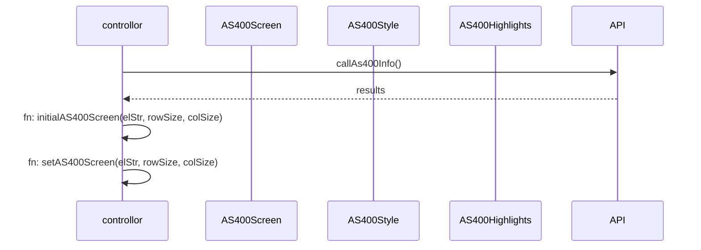

[TOC]

# Component

```php+HTML
<div class="screen">
  <div class="ssq as400-highlights"></div>
  <div class="ssq as400-style"></div>
  <textarea class="ssq as400-screen"></textarea>
</div>
```

## Class

### \${name} as400-highlights

เป็นส่วนของการแสดงผลข้อความที่ถูก mark ใช้สำหรับการ mapping field หรือ list โดยสีพื้นหลังเป็นสีดำ

### \${name} as400-style

เป็นส่วนของการแสดงผลสีของข้อความ โดยสีที่เป็นค่าตั้งต้นเป็นสีขาว

| ตัวอักษร | สีข้อความ | โคดสี   | รายละเอียด    |
| -------- | --------- | ------- | ------------- |
| R        | แดง       | #fF0000 |               |
| G        | เขียว     | #00FF00 |               |
| B        | นำ้เงิน   | #0000FF |               |
| W        | ขาว       | #FFFFFF |               |
| P        | ชมพู      | #FF1493 |               |
| Y        | เหลือง    | #FFFF00 |               |
| V        | ม่วง      | #8A2BE2 |               |
| L        | ดำ        | #000000 |               |
| O        | ส้ม       | #FF4500 |               |
| A        | นำ้ตาล    | #8B4513 |               |
| U        | ขาว       | #FFFFFF | ขีดเส้นใต้    |
| H        | ขาว       | #FFFFFF | ซ่อนการแสดงผล |

### \${name} as400-screen

เป็นส่วนของการแสดงผลข้อความ สำหรับป้อนข้อมูล และเลือกข้อความที่ mapping โดยสีที่เป็นค่าตั้งต้นเป็นใสๆ

## function

### setAs400Screen(elStr, data)

เป็น Function สำหรับแสดงข้อความจาก as400

#### params

##### elStr : string

คือ ชื่อของ class element ของ textarea เช่น elStr เป็น "ssq"

```php+HTML
<textarea class="ssq as400-screen"></textarea>
```

##### data : string

คือ ข้อความที่ต้องการแสดงผล

### setAs400Style(elStr, data)

เป็น Function สำหรับแสดงสีของข้อความจาก as400

#### params

##### elStr : string

คือ ชื่อของ class element ของ div เช่น elStr เป็น "ssq"

```php+HTML
<div class="ssq as400-style"></div>
```

##### data : string

คือ ข้อความที่ต้องการแสดงผล

### setAs400Highlight(elStr, startIndex, endIndex, markType)

เป็น Function สำหรับแสดงสีของข้อความจาก as400

#### params

##### elStr : string

คือ ชื่อของ class element ของ div เช่น elStr เป็น "ssq"

```php+HTML
<div class="ssq as400-highlights"></div>
```

##### startIndex : int

คือ ตำแหน่งแรกสำหรับการ mapping

##### startIndex : int

คือ ตำแหน่งสุดท้ายสำหรับการ mapping

##### markType : string

คือ ชื่อของ className สำหรับแสดง Style ของตำแหน่งที่ mark

### clearAs400Highlight(elStr)

เป็น Function สำหรับแสดงสีของข้อความจาก as400

### setAs400HighlightLsit(elStr, highlightsList)

เป็น Function สำหรับแสดงสีของข้อความจาก as400

#### params

##### elStr : string

คือ ชื่อของ class element ของ div เช่น elStr เป็น "ssq"

```php+HTML
<div class="ssq as400-highlights"></div>
```

##### highlightsList : List [object]

คือ list ของข้อมูลที่ต้องการให้ทำการ mapping

## Work Flow


